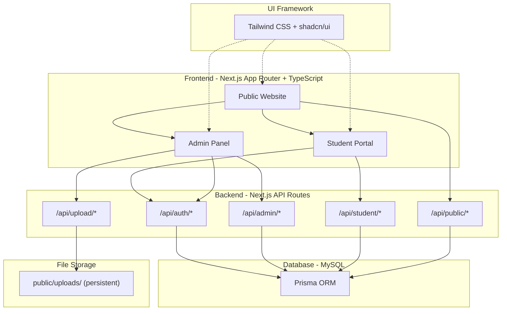
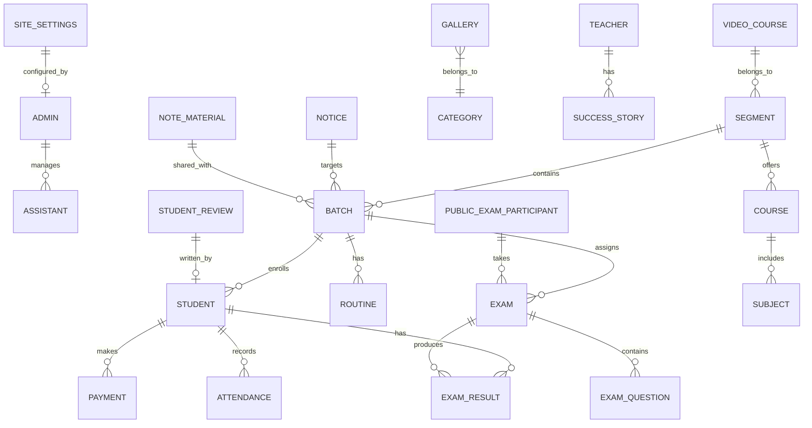
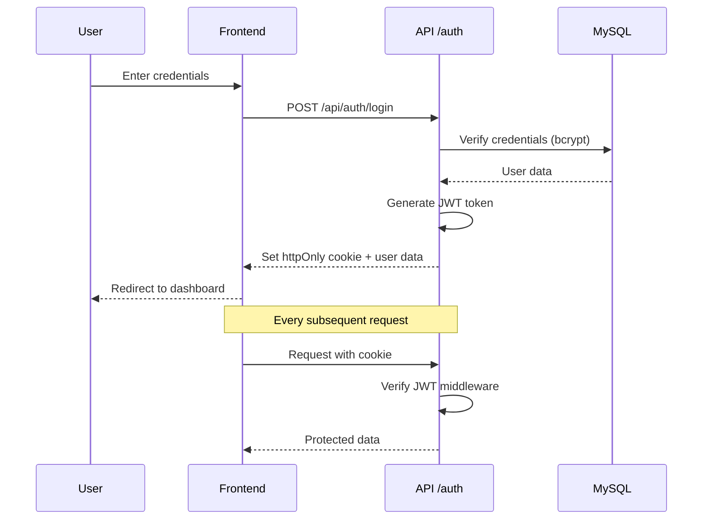
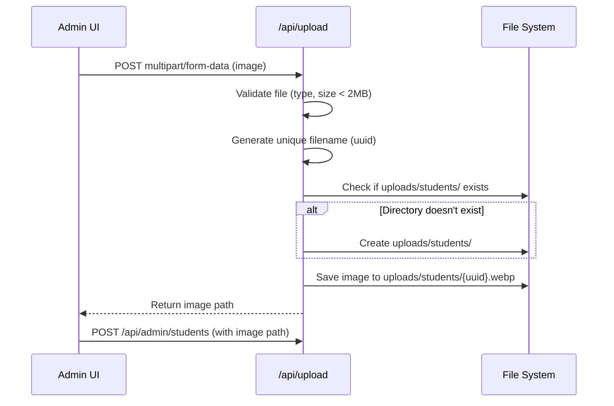
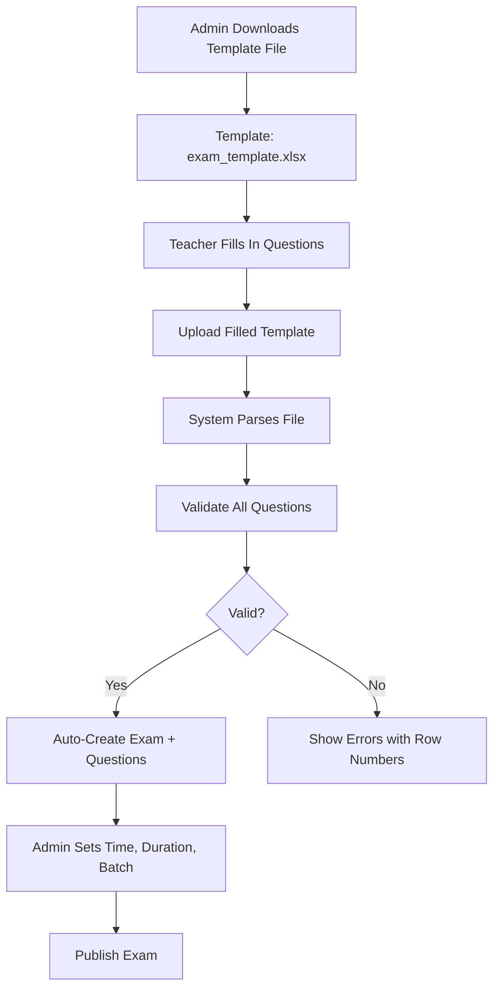
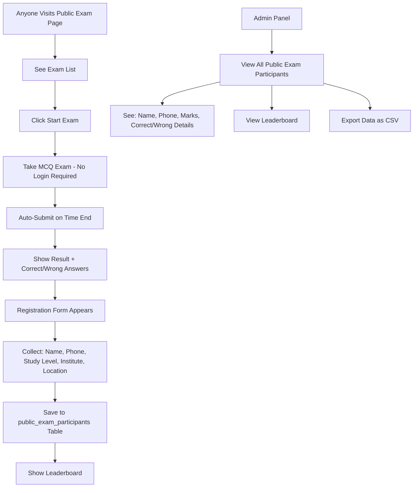
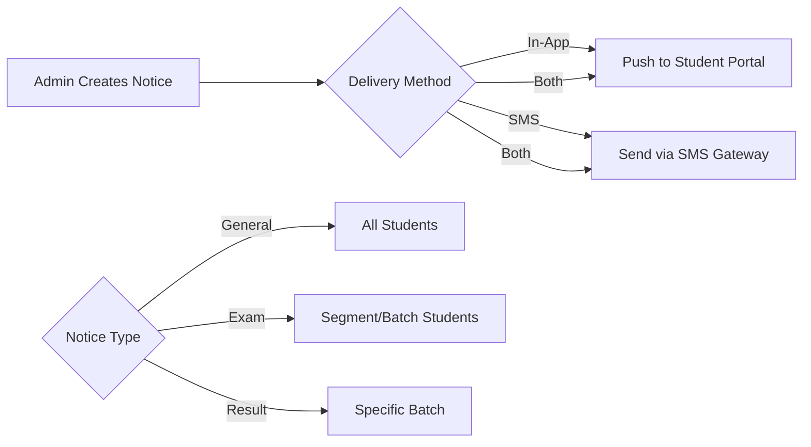

# DoctorBiology LMS — Full Implementation Plan (v2)

> **Project**: Educational LMS Platform (SaaS-Ready)
> **Tech Stack**: Next.js 14 (App Router), TypeScript, Tailwind CSS, shadcn/ui, Next API Routes, MySQL (Prisma ORM), cPanel Deployment
> **Goal**: Build a production-grade coaching/institute management system that can be easily replicated for other institutes with separate DB, domain & hosting — only design/config changes needed.

---

## Global Requirements

> [!IMPORTANT]
> 1. **Fully Responsive UI**: Every single page, table, and modal MUST be 100% responsive and look perfect on all devices (mobile, tablet, desktop). Use shadcn/ui Sheet for mobile navigation, horizontal scrolling for data tables, and flex/grid layouts.
> 2. **Professional Pagination**: Whenever data lists or tables are displayed (e.g., Assistants, Students, Courses), there MUST be a professional pagination system (server-side or client-side depending on data size) to ensure a clean UI and optimal performance.
> 3. **PWA Setup (Progressive Web App)**: The application MUST be a properly configured PWA so students and admins can install it on their phones/desktops. Includes `manifest.json`, offline fallback, and service workers (using `next-pwa` or `@serwist/next`).

---

## Architecture Overview



---

## Tech Stack Details

| Layer | Technology | Reason |
|---|---|---|
| **Framework** | Next.js 14 (App Router) | SSR/SSG, API routes, file-based routing |
| **Language** | TypeScript | Type safety, better DX, scalable codebase |
| **Styling** | Tailwind CSS | Utility-first, fast development, easy theming |
| **UI Components** | shadcn/ui | Pre-built, customizable, accessible components |
| **ORM** | Prisma | Type-safe DB queries, migrations, schema management |
| **Database** | MySQL | Reliable, widely supported on cPanel |
| **Auth** | JWT (httpOnly cookies) | Secure, stateless authentication |
| **Animation** | Framer Motion + AOS | Smooth scroll & page transitions |
| **File Upload** | Custom API handler (multer/formidable) | On-demand directory creation |
| **i18n** | next-intl or custom context | Optional Bangla/English toggle |

---

## SaaS / Replication Strategy

> [!IMPORTANT]
> Each institute gets **completely separate** infrastructure. No shared database.

| Concern | Strategy |
|---|---|
| **Branding** | All brand colors, logo, institute name, tagline stored in DB `site_settings` table + `site.config.ts` |
| **Theme** | Tailwind CSS config + CSS variables driven from `site.config.ts`. Switching institute = changing config file |
| **Database** | **Separate MySQL database** per institute. Each has its own `.env` with `DATABASE_URL` |
| **Domain** | **Separate domain/subdomain** per institute. Each deployment has its own hosting |
| **Deployment** | Clone repo → update `.env` + `site.config.ts` → deploy to cPanel. That's it |
| **Code** | Same codebase for all. Zero code changes needed per institute |
| **Setup Ease** | One config file (`site.config.ts`) controls: institute name, logo, colors, contact, social links, feature flags |

**`site.config.ts` Example:**
```typescript
export const siteConfig = {
  instituteName: "DoctorBiology",
  tagline: "Your Gateway to Medical Success",
  logo: "/assets/logo.png",
  theme: {
    primary: "#0D9488",
    secondary: "#7C3AED",
    accent: "#F59E0B",
  },
  contact: {
    phone: "+880-XXXX-XXXXXX",
    email: "info@doctorbiology.com",
    whatsapp: "+880XXXXXXXXXX",
    address: "Dhaka, Bangladesh",
  },
  features: {
    smsEnabled: false,
    onlineExamEnabled: true,
    publicExamEnabled: true,
    videoCourseEnabled: true,
    multiLanguage: true,       // toggle Bangla/English feature on/off
    defaultLanguage: "bn",     // "bn" or "en"
  },
  seo: {
    defaultTitle: "DoctorBiology - Best Medical Coaching",
    defaultDescription: "...",
  }
}
```

---

## cPanel Deployment — Image Upload Strategy

> [!IMPORTANT]
> **Problem**: When deploying on cPanel (extract zip), the `public/` folder gets overwritten, which deletes uploaded images.

**Solution**:

1. **Upload directory**: `public/uploads/` — This folder will be created **programmatically by the API** on first upload if it doesn't exist.
2. **Deployment flow**:
   - Build → zip → upload to cPanel → extract
   - The zip will **NOT** contain `public/uploads/` folder
   - API routes will create `public/uploads/{category}/` directories on-demand (e.g., `uploads/gallery/`, `uploads/banners/`, `uploads/students/`)
3. **`.gitignore`**: Add `public/uploads/` to `.gitignore` so it's never in the build artifact
4. **Alternative (Better for production)**: Store files outside `public/` in a persistent directory on the server (e.g., `/home/user/persistent_uploads/`) and serve via a custom API route. This is the safest approach for cPanel.

> [!TIP]
> We'll implement **both approaches** — local `public/uploads/` for development and a configurable `UPLOAD_DIR` env variable for production that can point to a persistent server path outside the Next.js app directory.

---

## Multi-Language System (Bangla/English)

> [!NOTE]
> The language system is **completely optional**. Institute can enable or disable it from `site.config.ts`.

| Setting | Behavior |
|---|---|
| `multiLanguage: true` | Show language toggle button (🇧🇩 / 🇬🇧) in navbar. User can switch |
| `multiLanguage: false` | No toggle shown. Uses `defaultLanguage` value only |
| `defaultLanguage: "bn"` | All UI labels in Bangla by default |
| `defaultLanguage: "en"` | All UI labels in English by default |

**Implementation:**
- Translation files: `src/locales/bn.json` & `src/locales/en.json`
- React Context `LanguageProvider` wraps entire app
- All UI text uses `t("key")` helper function
- Dynamic content from DB stays as-is (admin enters in whatever language they want)

---

## Database Schema (High-Level ERD)



---

## 🔧 Step-by-Step Implementation Plan (15 Steps)

---

### Step 1: Project Initialization & Architecture Setup

**What we build:**
- Initialize Next.js 14 project with App Router + TypeScript
- Install & configure Tailwind CSS
- Install & configure shadcn/ui component library
- Setup folder structure (SaaS-friendly, modular)
- Configure Prisma with MySQL
- Setup environment variables
- Configure ESLint, Prettier
- Create `site.config.ts` for SaaS configuration
- Setup Tailwind theming with CSS variables (dark/light mode)
- Install core dependencies (bcrypt, jsonwebtoken, framer-motion, aos, etc.)

**Folder Structure:**
```
DoctorBiology/
├── prisma/
│   ├── schema.prisma
│   └── seed.ts
├── src/
│   ├── app/
│   │   ├── (public)/              # Public website routes
│   │   │   ├── page.tsx           # Home
│   │   │   ├── about/page.tsx
│   │   │   └── success/page.tsx
│   │   ├── (student)/             # Student portal routes
│   │   │   ├── student/
│   │   │   │   ├── dashboard/page.tsx
│   │   │   │   ├── exams/page.tsx
│   │   │   │   ├── notes/page.tsx
│   │   │   │   └── payments/page.tsx
│   │   │   └── layout.tsx
│   │   ├── (admin)/               # Admin panel routes
│   │   │   ├── admin/
│   │   │   │   ├── dashboard/page.tsx
│   │   │   │   ├── students/page.tsx
│   │   │   │   ├── exams/page.tsx
│   │   │   │   ├── payments/page.tsx
│   │   │   │   ├── courses/page.tsx
│   │   │   │   ├── website/page.tsx
│   │   │   │   ├── assistants/page.tsx
│   │   │   │   └── notifications/page.tsx
│   │   │   └── layout.tsx
│   │   ├── api/                   # API routes
│   │   │   ├── auth/
│   │   │   ├── admin/
│   │   │   ├── student/
│   │   │   ├── public/
│   │   │   └── upload/
│   │   ├── layout.tsx             # Root layout with providers
│   │   └── globals.css
│   ├── components/
│   │   ├── ui/                    # shadcn/ui components (auto-generated)
│   │   ├── shared/                # Custom shared components
│   │   ├── public/                # Public page components
│   │   ├── student/               # Student portal components
│   │   └── admin/                 # Admin panel components
│   ├── lib/
│   │   ├── db.ts                  # Prisma client singleton
│   │   ├── auth.ts                # Auth utilities (JWT, session)
│   │   ├── upload.ts              # File upload handler
│   │   ├── sms.ts                 # SMS integration
│   │   ├── utils.ts               # Common utilities
│   │   └── validations.ts         # Zod schemas for form validation
│   ├── hooks/                     # Custom React hooks
│   │   ├── useAuth.ts
│   │   ├── useTheme.ts
│   │   └── useLanguage.ts
│   ├── context/                   # React context providers
│   │   ├── ThemeProvider.tsx
│   │   ├── AuthProvider.tsx
│   │   └── LanguageProvider.tsx
│   ├── config/
│   │   ├── site.config.ts         # SaaS site configuration (THE key file)
│   │   └── permissions.ts         # Role-based permissions map
│   ├── types/                     # TypeScript type definitions
│   │   ├── index.ts
│   │   ├── api.ts
│   │   ├── models.ts
│   │   └── forms.ts
│   └── locales/                   # i18n translation files
│       ├── bn.json                # Bangla translations
│       └── en.json                # English translations
├── public/
│   ├── uploads/                   # (gitignored) runtime uploads
│   ├── assets/                    # Static assets (icons, default images)
│   └── templates/                 # Exam template files for download
│       └── exam_template.xlsx
├── components.json                # shadcn/ui config
├── tailwind.config.ts
├── tsconfig.json
└── .env.local
```

**Functionality:**
- ✅ Next.js app boots with TypeScript + Tailwind CSS + shadcn/ui
- ✅ Dark/Light mode toggle using `next-themes` + Tailwind `darkMode: "class"`
- ✅ Prisma connects to MySQL with singleton pattern
- ✅ `site.config.ts` controls all branding, features, and SEO
- ✅ shadcn/ui base components installed (Button, Input, Card, Dialog, Table, Badge, Sheet, Tabs, etc.)
- ✅ Language toggle system with `bn.json` / `en.json`

**Bottlenecks & Risks:**
| Risk | Mitigation |
|---|---|
| MySQL connection pooling issues in serverless | Use Prisma singleton pattern with global cache |
| shadcn/ui component customization conflicts | Use the `cn()` utility for merging Tailwind classes |
| Large bundle size from animation libs | Dynamic import AOS & Framer Motion |
| TypeScript strict mode errors | Enable strict mode from start; define proper types for all data |

---

### Step 2: Database Schema Design & Migration

**What we build:**
- Complete Prisma schema with all tables (TypeScript-typed)
- Run initial migration
- Seed data script (demo admin, demo segments, demo batches)
- All tables designed for **scalability** — proper indexes, foreign keys, soft deletes

**Core Tables:**

| Table | Key Fields | Notes |
|---|---|---|
| `admins` | id, name, email, password, role(super_admin/assistant), permissions(JSON), is_active, created_at, updated_at | Super admin has all permissions |
| `segments` | id, name(SSC/HSC/Admission), slug, description, status, sort_order, created_at | 3 initial segments, can add more |
| `batches` | id, segment_id, name, year, status(active/inactive), max_students, created_at, updated_at | FK to segment |
| `students` | id, student_id(auto), name, gender, dob, address, phone, email, password, batch_id, parent_name, parent_relation, parent_phone, photo, status(active/inactive), enrolled_at, created_at, updated_at | Auto-increment student_id |
| `courses` | id, segment_id, name, fee, duration, details(text), subjects(JSON), next_registration_date, status, created_at | Course per segment |
| `routines` | id, batch_id, day_of_week, start_time, end_time, subject, room, teacher_name, created_at | Weekly schedule |
| `exams` | id, title, batch_id(nullable), segment_id, type(online_mcq/offline), is_public, start_time, end_time, duration_minutes, total_marks, status(draft/published/completed), negative_marking, created_at | Both exam types. is_public=true means anyone can take |
| `exam_questions` | id, exam_id, question_text, option_a, option_b, option_c, option_d, correct_option(a/b/c/d), marks, explanation(nullable), sort_order | Individual columns for options (scalable, searchable) |
| `exam_results` | id, exam_id, student_id(nullable), obtained_marks, total_marks, correct_count, wrong_count, skipped_count, rank, answers(JSON), time_taken_seconds, created_at | student_id nullable for public exam participants |
| `public_exam_participants` | id, exam_id, name, phone, institution, study_level, location, exam_result_id, created_at | Data collected after public exam |
| `payments` | id, student_id, amount, due_amount, month, year, status(paid/due/partial), receipt_number, paid_at, note, created_at | Monthly payment tracking |
| `attendance` | id, student_id, batch_id, date, status(present/absent/late), note, created_at | Daily attendance |
| `notices` | id, title, content, target_type(all/segment/batch), target_id, type(general/exam/result), is_pinned, created_at | Notice board |
| `gallery` | id, image_path, category(home/success/about), caption, sort_order, created_at | Image gallery |
| `teachers` | id, name, bio, qualifications, specialist_subjects(JSON), experience, photo, sort_order, created_at | Teacher profiles |
| `teacher_successes` | id, teacher_id, student_name, exam_type, gpa, placement, photo, year, sort_order, created_at | Success stories |
| `student_reviews` | id, student_name, image, batch_name, current_position, description, rating, is_featured, sort_order, created_at | Testimonials |
| `video_courses` | id, segment_id, title, description, url(YouTube/external link), price, thumbnail, sort_order, status, created_at | **Link only** — no upload. Just URL + metadata |
| `notes_materials` | id, title, file_path, batch_id, segment_id, type(book/note), description, sort_order, created_at | Study materials (PDF upload) |
| `site_settings` | id, setting_key(unique), setting_value, setting_type(text/image/json/boolean), group_name, created_at, updated_at | Dynamic site config |
| `social_media` | id, platform_name, url, icon, sort_order, is_active, created_at | Social links |
| `hero_banners` | id, teacher_photo, description, bg_image, cta_text, cta_link, is_active, created_at | Homepage hero |
| `sms_logs` | id, student_id, phone, message, type(exam_notice/result/attendance), status(sent/failed/queued), sent_at | SMS tracking |

**Scalability Design Decisions:**
| Decision | Reason |
|---|---|
| `created_at` + `updated_at` on all tables | Audit trail, debugging, sorting |
| `sort_order` on display tables | Admin can reorder items without code changes |
| `status` columns (active/inactive) | Soft delete — never lose data |
| `JSON` only for flexible, non-searchable data | Keep searchable fields as separate columns |
| Nullable `batch_id` on exams | Allows segment-wide exams, not just batch-specific |
| Separate `public_exam_participants` table | Clean separation from enrolled students |
| Individual option columns (a/b/c/d) | Easier to query, display, and template than JSON array |

**Functionality:**
- ✅ All tables created with proper indexes and foreign keys
- ✅ Seed script creates super admin (email: admin@doctorbiology.com)
- ✅ Seed script creates 3 segments (SSC, HSC, Medical Admission)
- ✅ All Prisma types auto-generated for TypeScript

**Bottlenecks & Risks:**
| Risk | Mitigation |
|---|---|
| Schema changes after students have data | Always use Prisma migrations (never raw SQL) |
| JSON fields not searchable efficiently | Keep searchable fields as separate columns; use JSON only for flexible data |
| Student ID uniqueness | Simple auto-increment integer. Display format: padded `#0001`, `#0002` |
| Payment month/year tracking | Use separate month + year columns, not date ranges |
| Large exam_results table over time | Add composite index on (exam_id, student_id) and (student_id, created_at) |

---

### Step 3: Authentication System (Admin + Student)

**What we build:**
- Admin login page (`/admin/login`) — shadcn/ui form
- Student login page (`/student/login`) — shadcn/ui form
- JWT-based authentication with httpOnly cookies
- Role-based middleware (super_admin, assistant, student)
- Permission-based access control for assistants
- Session management & auto-logout
- TypeScript types for auth state

**Auth Flow:**


**API Routes:**
| Route | Method | Description |
|---|---|---|
| `/api/auth/admin/login` | POST | Admin/Assistant login |
| `/api/auth/admin/logout` | POST | Clear admin session |
| `/api/auth/student/login` | POST | Student login (ID + password) |
| `/api/auth/student/logout` | POST | Clear student session |
| `/api/auth/me` | GET | Get current user info |
| `/api/auth/change-password` | PUT | Change password |

**TypeScript Types:**
```typescript
interface AuthUser {
  id: number;
  name: string;
  email: string;
  role: "super_admin" | "assistant" | "student";
  permissions: Permission[];
}

type Permission =
  | "student_payment"
  | "courses"
  | "student_management"
  | "study_materials"
  | "exam_questions"
  | "segment_batches"
  | "notes"
  | "notifications"
  | "website";
```

**Functionality:**
- ✅ Admin logs in with email + password
- ✅ Student logs in with Student ID + password
- ✅ JWT stored in httpOnly secure cookie (not localStorage)
- ✅ Middleware checks auth on every protected API route
- ✅ Assistant permissions checked per route (e.g., can only access "Student Payment" if permitted)
- ✅ Auto-redirect to login if session expires
- ✅ Zod validation on all login forms

**Bottlenecks & Risks:**
| Risk | Mitigation |
|---|---|
| JWT token stolen via XSS | httpOnly cookies (not accessible via JS) |
| No refresh token = frequent re-login | Set JWT expiry to 7 days; implement refresh token later |
| Assistant permission bypass | Server-side permission check on EVERY API route, not just UI hiding |
| Brute force attacks | Rate limiting on login endpoints (5 attempts / 15 min) |

---

### Step 4: Admin Panel — Dashboard & Layout

**What we build:**
- Admin layout with sidebar navigation (shadcn/ui Sheet for mobile)
- Dashboard page with summary cards (shadcn/ui Card)
- Responsive sidebar (collapsible on mobile)
- Dark/Light mode toggle in admin (shadcn/ui DropdownMenu)
- Breadcrumb navigation (shadcn/ui Breadcrumb)
- Language toggle (if enabled in config)

**Dashboard Cards:**
| Card | Data Source | Query |
|---|---|---|
| Total Students | `students` table | `COUNT(*) WHERE status='active'` |
| Batchwise Students | `students` + `batches` | `GROUP BY batch_id` with batch name — shown in shadcn Table |
| Total Payment Received | `payments` WHERE status=paid | `SUM(amount)` |
| Total Payment Due | `payments` WHERE status=due | `SUM(due_amount)` |
| Recent Results | `exam_results` + `exams` | Latest 5 results |

**Sidebar Menu Structure:**
```
📊 Dashboard
📅 Teacher Routine
👥 Assistants Team        ← Super Admin only
💳 Student Payment
📚 Courses & Batches
🎬 Video Courses
👨‍🎓 Student Management
📝 Exams
📖 Study Materials
📢 Notifications
🌐 Website Management
⚙️ Settings
```

**Functionality:**
- ✅ Dashboard loads with real-time data via API
- ✅ Sidebar shows/hides menu items based on assistant permissions
- ✅ Batchwise student count in expandable shadcn/ui Table
- ✅ Quick action buttons (Add Student, Create Exam, Post Notice)
- ✅ Recent activity feed
- ✅ All using shadcn/ui components (Card, Table, Badge, Button, etc.)

**Bottlenecks & Risks:**
| Risk | Mitigation |
|---|---|
| Dashboard slow with many students | Cache dashboard stats in server component, revalidate on data change |
| Sidebar permissions not updating | Fetch permissions on each page load (from JWT payload) |
| Mobile sidebar overlapping content | Use shadcn/ui Sheet component (slide-out overlay) |

---

### Step 5: Admin — Assistants Team Management

**What we build:**
- Add/Edit/Delete assistants (shadcn/ui Dialog forms)
- Granular permission system (shadcn/ui Checkbox group)
- Assistant profile page

**Permission Matrix:**

| Permission Key | Description | Scope |
|---|---|---|
| `student_payment` | View/manage student payments | Full CRUD |
| `courses` | Manage courses, batches | Full CRUD |
| `student_management` | Add/edit/delete students | Full CRUD |
| `study_materials` | Upload/manage notes & books | Full CRUD |
| `exam_questions` | Create/edit exam questions | By Segment |
| `segment_batches` | Manage segments & batches | Full CRUD |
| `notes` | Manage notes (by segment/batch) | Filtered |
| `notifications` | Send notifications/SMS | Full |
| `website` | Manage website content | Full CRUD |

**API Routes:**
| Route | Method | Description |
|---|---|---|
| `/api/admin/assistants` | GET | List all assistants |
| `/api/admin/assistants` | POST | Create new assistant |
| `/api/admin/assistants/[id]` | GET | Get assistant details |
| `/api/admin/assistants/[id]` | PUT | Update assistant + permissions |
| `/api/admin/assistants/[id]` | DELETE | Soft-delete assistant |

**Functionality:**
- ✅ Only Super Admin can access this section
- ✅ Add assistant with name, age, address, contact, email, password
- ✅ Toggle permissions with shadcn/ui Checkboxes
- ✅ Assistant sees only permitted menu items in sidebar
- ✅ Zod validation on all forms

**Bottlenecks & Risks:**
| Risk | Mitigation |
|---|---|
| Permission escalation | Assistant cannot modify their own permissions; only super admin can |
| Deleted assistant still has valid JWT | On delete, invalidate by checking `is_active` on every auth middleware call |
| Too many permission levels = confusion | Group permissions logically, provide "Select All" toggle |

---

### Step 6: Admin — Course, Segment & Batch Management

**What we build:**
- Segment management (SSC, HSC, Medical Admission)
- Batch CRUD within segments
- Course details management (fee, duration, subjects, next registration date)
- Batch routine management (weekly schedule)

**API Routes:**
| Route | Method | Description |
|---|---|---|
| `/api/admin/segments` | GET/POST | List/Create segments |
| `/api/admin/segments/[id]` | PUT/DELETE | Update/Soft-delete segment |
| `/api/admin/batches` | GET/POST | List/Create batches |
| `/api/admin/batches/[id]` | PUT/DELETE | Update/Soft-delete batch |
| `/api/admin/batches/[id]/routine` | GET/POST/PUT | Manage batch routine |
| `/api/admin/courses` | GET/POST | List/Create courses |
| `/api/admin/courses/[id]` | PUT/DELETE | Update/Delete course |

**Routine Builder UI:**
- Weekly grid view (Sat–Fri) using shadcn/ui Table
- Time slot entries with shadcn/ui Dialog for add/edit
- Color-coded subjects via Tailwind badges
- Print-friendly view (CSS print media query)

**Functionality:**
- ✅ 3 segments pre-created via seed (can add more)
- ✅ Unlimited batches per segment
- ✅ Course details with fee, subjects (shadcn/ui multi-select), duration
- ✅ Visual routine builder with time slots
- ✅ Teacher routine view (aggregated from all batches)

**Bottlenecks & Risks:**
| Risk | Mitigation |
|---|---|
| Deleting segment with active students | Soft delete (set status=inactive) instead of hard delete |
| Routine time conflicts | Validate no overlapping time slots for same batch on server-side |
| Course fee changes affecting existing payments | Course fee is snapshot at enrollment time, stored in payment record |

---

### Step 7: Admin — Student Management

**What we build:**
- Add student form with photo upload (shadcn/ui form + Zod validation)
- Student list with filters (segment, batch, search) — shadcn/ui DataTable
- Student profile page (full details + results + ranking + payment) — shadcn/ui Tabs
- Edit/Delete student
- Auto-generate Student ID (simple auto-increment)

**Student Profile Page Tabs (shadcn/ui Tabs):**
1. **Overview** — Name, photo, DOB, address, contact, parent info, batch
2. **Attendance** — Calendar view (see Step 12 for details)
3. **Exam Results** — All results with marks, rank in shadcn/ui Table
4. **Ranking** — Overall position in batch
5. **Payments** — All payments with status, download receipt

**API Routes:**
| Route | Method | Description |
|---|---|---|
| `/api/admin/students` | GET | List students (with filters & pagination) |
| `/api/admin/students` | POST | Add new student (with photo upload) |
| `/api/admin/students/[id]` | GET | Full student profile |
| `/api/admin/students/[id]` | PUT | Update student |
| `/api/admin/students/[id]` | DELETE | Soft-delete student |
| `/api/admin/students/[id]/results` | GET | Student's all exam results |
| `/api/admin/students/[id]/payments` | GET | Student's payment history |
| `/api/admin/students/[id]/attendance` | GET | Student's attendance records |

**Image Upload Flow:**


**Functionality:**
- ✅ Student ID: simple auto-increment (`#0001`, `#0002`, ...)
- ✅ Photo upload with compression to WebP
- ✅ Paginated student list (20 per page) with shadcn/ui DataTable
- ✅ Search by name, student ID, phone
- ✅ Filter by segment, batch, status using shadcn/ui Select
- ✅ Student profile with tabbed view (shadcn/ui Tabs)
- ✅ Password auto-generated, shown once to admin for sharing

**Bottlenecks & Risks:**
| Risk | Mitigation |
|---|---|
| Large student photos slow page load | Compress to WebP, max 500x500px |
| Student ID collision on concurrent adds | DB auto-increment handles this automatically |
| Deleting student with exam history | Soft delete — mark as inactive, preserve data |
| Photo upload fails mid-request | Upload image first, then create student record |

**Step 7 Implementation Checklist:**
- [x] Create API for Students (`/api/admin/students`)
- [x] Implement secure password hashing and auto-generate `student_id` (e.g. `#0001`)
- [x] Create frontend UI (`/admin/students`) with Data Table and Pagination
- [x] Add Student Enrollment form matching the Prisma Schema
- [x] Verify build stability (`yarn build`)

---

### Step 8: Admin — Exam System (Online MCQ + Offline Results)

**What we build:**
- Create online MCQ exams
- **Template-based question import** — Download Excel/CSV template → Teacher fills in → Upload → Exam auto-created
- Add questions manually (alternative to template)
- Set exam as public or private (batch-specific)
- Set start/end time & duration
- Offline exam result entry (manual marks)
- Leaderboard generation
- Auto-ranking after exam

**🆕 Template-Based Exam Creation Flow:**


**Template File Structure (Excel/CSV):**
| Column | Description | Required |
|---|---|---|
| `question` | The question text | ✅ |
| `option_a` | Option A text | ✅ |
| `option_b` | Option B text | ✅ |
| `option_c` | Option C text | ✅ |
| `option_d` | Option D text | ✅ |
| `correct_answer` | Correct option: a, b, c, or d | ✅ |
| `marks` | Marks for this question (default: 1) | ❌ |
| `explanation` | Explanation for correct answer | ❌ |

**Example Template Content:**
```
question,option_a,option_b,option_c,option_d,correct_answer,marks,explanation
"Which organelle is the powerhouse?","Nucleus","Mitochondria","Ribosome","Golgi Body","b",1,"Mitochondria produces ATP"
"DNA stands for?","Deoxyribonucleic Acid","Dinitro Acid","Dynamic Nuclear Acid","None","a",1,""
```

**Public Exam Flow (New — based on your feedback):**


**API Routes:**
| Route | Method | Description |
|---|---|---|
| `/api/admin/exams` | GET/POST | List/Create exams |
| `/api/admin/exams/[id]` | GET/PUT/DELETE | Manage exam |
| `/api/admin/exams/[id]/questions` | GET/POST | Add questions manually |
| `/api/admin/exams/[id]/import` | POST | **Upload template file → auto-create questions** |
| `/api/admin/exams/template` | GET | **Download blank template file** |
| `/api/admin/exams/[id]/results` | GET | Get all results (students + public participants) |
| `/api/admin/exams/[id]/results` | POST | Publish offline results |
| `/api/admin/exams/[id]/leaderboard` | GET | Get ranked leaderboard |
| `/api/admin/exams/[id]/participants` | GET | **Public exam participants list** |
| `/api/public/exams` | GET | List public exams (no auth) |
| `/api/public/exams/[id]` | GET | Get public exam questions (during exam time) |
| `/api/public/exams/[id]/submit` | POST | Submit answers (no auth) |
| `/api/public/exams/[id]/register` | POST | **Save participant data after exam** |
| `/api/student/exams` | GET | List available exams for logged-in student |
| `/api/student/exams/[id]` | GET | Get exam questions (during exam time only) |
| `/api/student/exams/[id]/submit` | POST | Submit answers |

**Functionality:**
- ✅ Create MCQ exam with multiple questions (manual or template upload)
- ✅ **Download exam template (Excel/CSV)** — teacher fills in, uploads back
- ✅ **Auto-parse template** → validate → create questions. Show errors with row numbers if invalid
- ✅ Set public (anyone can take, no login) or private (batch-specific, student login required)
- ✅ Timer-based exam (auto-submit on time end)
- ✅ Auto-calculate marks and generate ranking
- ✅ **Public exam: After submit → show result → show registration form → collect data**
- ✅ **Admin can view all public exam participants with their marks and details**
- ✅ Offline exam: Admin enters marks manually per student
- ✅ Leaderboard with rank, marks, student name
- ✅ Question shuffling option for online exams

**Bottlenecks & Risks:**
| Risk | Mitigation |
|---|---|
| Student submits exam after time ends | Server-side time validation — reject late submissions |
| Student opens exam in multiple tabs | Track exam session with unique token stored in sessionStorage |
| Ranking ties | Same marks = same rank, next rank skips (1, 2, 2, 4) |
| Offline result entry for 200+ students | Bulk entry form with paste-from-spreadsheet support |
| Exam questions leaked via API | Questions only returned after exam start time, never before |
| Template file with wrong format | Validate every row, return clear error messages with row numbers |
| Public exam spam submissions | Rate limit by IP + fingerprint. One submission per browser session |
| Template file too large | Limit to 500 questions per upload |

---

### Step 9: Admin — Payment Management

- [x] **Step 9: Admin — Payment Management**
  - [x] Create API for Payments (`/api/admin/payments`)
  - [x] Create frontend UI (`/admin/payments`) with Data Table and Pagination
  - [x] Add Payment Recording Form (Amount, Due, Month, Status, Receipt)
  - [x] Verify build stability (`yarn build`)

**What we build:**
- Payment dashboard (total due by month) — shadcn/ui Cards + Charts
- Due payment students list — shadcn/ui DataTable
- Record payment (mark as paid) — shadcn/ui Dialog form
- Generate money receipt — PDF generation
- Payment history per student

**Payment Dashboard:**
| View | Data |
|---|---|
| Monthly Due Summary | Bar chart showing due amount per month |
| Due Students List | DataTable with student name, batch, due months, total due |
| Click Student → | Opens student profile with payment tab |

**API Routes:**
| Route | Method | Description |
|---|---|---|
| `/api/admin/payments/dashboard` | GET | Payment summary stats |
| `/api/admin/payments/due` | GET | List due students (with filters) |
| `/api/admin/payments` | POST | Record a payment |
| `/api/admin/payments/[id]/receipt` | GET | Generate receipt PDF |
| `/api/admin/payments/student/[id]` | GET | Student payment history |

**Money Receipt Fields:**
- Receipt Number (auto-generated)
- Student Name, ID, Batch
- Amount Paid
- Month(s) Covered
- Payment Date
- Institute Name & Logo (from `site.config.ts`)

**Functionality:**
- ✅ Monthly due tracking (auto-generate due entries each month based on course fee)
- ✅ Due students sorted by months overdue
- ✅ Click student → see profile with payment details
- ✅ Mark payment → auto-generate receipt number
- ✅ Download receipt as PDF
- ✅ Payment history with filters (month, year, status)

**Bottlenecks & Risks:**
| Risk | Mitigation |
|---|---|
| Partial payments | Allow partial payment, track remaining due in `due_amount` column |
| Auto-due generation timing | On-demand generation when viewing dashboard (check if current month entry exists) |
| Receipt number collision | Use format: `REC-{YEAR}{MONTH}-{SEQ}` with DB unique constraint |
| Student changes batch mid-month | Payment linked to student, not batch; batch is for display only |

---

### Step 10: Admin — Website Content Management

**What we build:**
- Hero banner editor (teacher photo, description, background image)
- Teacher profile management
- Success stories (student success + teacher success)
- Gallery management (with categories: home, success, about)
- Student reviews management
- Social media links management
- Promotion video management
- Notice board management

**API Routes:**
| Route | Method | Description |
|---|---|---|
| `/api/admin/website/hero` | GET/PUT | Manage hero banner |
| `/api/admin/website/teachers` | CRUD | Manage teacher profiles |
| `/api/admin/website/successes` | CRUD | Manage success stories |
| `/api/admin/website/gallery` | CRUD | Manage gallery images |
| `/api/admin/website/reviews` | CRUD | Manage student reviews |
| `/api/admin/website/social` | CRUD | Manage social media links |
| `/api/admin/website/video` | CRUD | Manage promotion videos |
| `/api/admin/notices` | CRUD | Manage notices |

**Gallery Upload:**
- Multi-image upload (up to 10 at once)
- Category selection (home / success / about) — shadcn/ui Select
- Drag-and-drop reordering
- Auto-compression to WebP

**Functionality:**
- ✅ All website content editable from admin panel
- ✅ Hero banner with live preview
- ✅ Teacher profile with photo, bio, qualifications
- ✅ Success stories with student photos, GPA, placement
- ✅ Gallery with category filtering
- ✅ Student reviews with star rating
- ✅ Social media links (Facebook, YouTube, etc.)
- ✅ Promotion video (YouTube embed link)

- [x] **Step 10: Admin — Website Content Management**
  - [x] Create API for Notices (`/api/admin/content/notices`)
  - [x] Create API for Hero Banner (`/api/admin/content/hero`)
  - [x] Create frontend UI (`/admin/content`) with Tabs for Notice Board and Hero Banner
  - [x] Verify build stability (`yarn build`)
- [x] **Step 11: Admin — Study Materials, Video Courses & Notifications**
  - [x] Create API for Notes/Books (`/api/admin/materials/notes`)
  - [x] Create API for Video Courses (`/api/admin/materials/videos`)
  - [x] Create frontend UI (`/admin/materials`) with Tabs for Notes and Videos
  - [x] Verify build stability (`yarn build`)
- [ ] **Step 12: Student Portal — Dashboard & Profile**

**What we build:**
- Notes/Books upload (PDF)
- Video course management (**link only** — URL, title, description, price, thumbnail)
- Notification system (in-app + SMS)
- Attendance management with calendar view

**Study Materials:**
| Field | Description |
|---|---|
| Title | Material name |
| Type | Book / Note |
| File | PDF upload |
| Segment | SSC / HSC / Admission |
| Batch | Specific batch (optional) |

**Video Course (Link-Only):**
| Field | Description |
|---|---|
| Title | Course name |
| Description | Course description |
| URL | YouTube or external link |
| Price | Course price (display only) |
| Thumbnail | Thumbnail image upload |
| Segment | SSC / HSC / Admission |

> [!NOTE]
> Video courses are **link-based only**. No actual video upload. Admin adds a YouTube/external URL with title, description, price, and thumbnail. This keeps storage minimal and deployment simple.

**Notification System:**


**SMS Integration:**
- Use configurable SMS gateway (API key in `.env`)
- SMS templates for: Exam Notice, Result Publish, Attendance Alert
- SMS log tracking (sent/failed)
- **SMS feature can be disabled** via `site.config.ts` → `features.smsEnabled: false`

**Attendance Calendar View:**
- Monthly calendar grid (shadcn/ui custom calendar component)
- Each date shows: color-coded status (green=present, red=absent, yellow=late)
- Click on a date → expands to show: attendance status, any exam that day, any result published, any event/notice
- Admin enters attendance per batch per day with "Mark all present" + toggle exceptions

**Functionality:**
- ✅ Upload PDF notes/books per batch or segment
- ✅ Video courses with link, title, description, price, thumbnail
- ✅ Send notification to all / segment / specific batch
- ✅ Choose delivery: Push (in-app) / SMS / Both
- ✅ SMS delivery log with status tracking
- ✅ Record attendance per batch per day
- ✅ Calendar view with click-to-expand details

**Bottlenecks & Risks:**
| Risk | Mitigation |
|---|---|
| SMS gateway rate limits | Queue SMS messages, process in batches of 50 |
| PDF files too large | Limit upload to 10MB |
| SMS cost tracking | Log every SMS with cost estimate from gateway |
| Attendance for 200+ students | Batch attendance with "Mark all present" + toggle exceptions |

---

### Step 12: Student Portal — Dashboard & Profile

**What we build:**
- Student login (Student ID + Password)
- Student dashboard (shadcn/ui Cards, Calendar)
- Student profile view
- Attendance calendar (click date → expand details)
- Recent reports & results

**Dashboard Widgets:**
| Widget | Component | Data |
|---|---|---|
| Welcome Card | shadcn Card | Student name, photo, batch, segment |
| Attendance Calendar | Custom Calendar | Monthly view, color-coded days. **Click date → expand: status, exam, result, event** |
| Recent Report | shadcn Card | Latest exam report card |
| Recent Result | shadcn Card | Latest exam result with marks & rank |
| Ranking Badge | Custom Badge | If ranked 1–10, show badge prominently with animation |
| Payment Status | shadcn Badge | Current month: Paid ✅ / Due ❌ |
| Upcoming Exam | shadcn Card | Next scheduled exam details with countdown |

**Attendance Calendar Detail (on date click):**
```
┌──────────────────────────────────────┐
│  📅 July 15, 2026                    │
├──────────────────────────────────────┤
│  🟢 Attendance: Present             │
│  📝 Exam: Biology Chapter 5 MCQ     │
│  📊 Result: 85/100 (Rank #3)        │
│  📢 Notice: "Tomorrow class off"    │
└──────────────────────────────────────┘
```

**Functionality:**
- ✅ Student logs in with ID + password
- ✅ Dashboard shows personalized data
- ✅ Calendar attendance view (click any date → expand and see report, result, event, attendance)
- ✅ Show rank badge if in top 10
- ✅ Quick links to exam, payment, notes

**Bottlenecks & Risks:**
| Risk | Mitigation |
|---|---|
| Student forgets password | Admin can reset password from student management |
| Attendance data loading slow for full year | Load by month on-demand (when user navigates months) |
| Rank calculation timing | Rank calculated and cached when exam results are published |

---

### Step 13: Student Portal — Exams, Notes & Payments

**What we build:**
- Exam list (upcoming + past)
- Take online MCQ exam (timer, question navigation)
- Exam result & leaderboard view
- Download notes/books
- Payment list with status
- Download payment receipt
- Notice list

**Online Exam UI (shadcn/ui components):**
```
┌─────────────────────────────────────────┐
│  Exam: Biology Chapter 5        ⏱ 28:45 │
├─────────────────────────────────────────┤
│  Q3 of 25                               │
│                                          │
│  What is the function of ribosomes?      │
│                                          │
│  ○ Energy production                     │
│  ● Protein synthesis                     │
│  ○ Cell division                         │
│  ○ DNA replication                       │
│                                          │
│  ◀ Prev    [1][2][●][4]...[25]   Next ▶  │
│                                          │
│  [Submit Exam]                           │
└─────────────────────────────────────────┘
```

**Functionality:**
- ✅ See upcoming exams with countdown timer
- ✅ Take online MCQ exam with server-validated timer
- ✅ Question navigation panel (jump to any question)
- ✅ Mark questions for review (highlighted in nav panel)
- ✅ Auto-submit when time runs out
- ✅ View result immediately after exam ends (if enabled)
- ✅ View leaderboard per exam
- ✅ Download notes/books (PDF)
- ✅ View payment history with paid/due status
- ✅ Download receipt for paid months
- ✅ View notice list

**Bottlenecks & Risks:**
| Risk | Mitigation |
|---|---|
| Internet disconnection during exam | Auto-save answers every 30 seconds to server |
| Student refreshes page during exam | Restore exam state from server (answers + remaining time) |
| Timer manipulation via browser DevTools | Timer is server-side; submission time validated against start time |
| Multiple submissions | Disable submit button after first click; server rejects duplicate |

---

### Step 14: Public Website — All Pages

**What we build:**
- Home page (Hero, Bio, Courses, Notice, Gallery, Reviews, Contact)
- About page (Hero, About Us, Gallery, Location, Contact)
- Success page (Teacher success, Student success, Top students, Gallery)
- Public exam page (list + take exam + registration form after)
- Public course registration form (data collection)
- WhatsApp floating button
- Responsive design (mobile-first with Tailwind)
- AOS scroll animations + Framer Motion page transitions
- Full SEO optimization (all meta tags)
- Language toggle (Bangla/English if enabled)

**Home Page Sections:**
1. **Hero Banner** — Teacher photo, short description, background image, CTA button
2. **Bio Section** — Left: Teacher profile (bio, qualifications, experience) | Right: Promotion video (YouTube embed)
3. **Courses Section** — 3 segment cards (SSC, HSC, Admission) with details, fee, enroll button
4. **Routine & Batches** — Current batches with routine preview
5. **Notice Board** — Latest notices carousel
6. **Gallery Section** — Masonry grid with category filter
7. **Video Course Section** — Video course cards with thumbnail, title, description, price
8. **কেনো আমরা আলাদা?** — USP section with icons and text
9. **Student Reviews** — Review cards with rating slider
10. **Contact Section** — Registration form + Google Map + Social links
11. **WhatsApp Float** — Fixed bottom-right floating button

**Public Exam Page Flow:**
1. Show list of public exams (upcoming + active)
2. Click exam → Start (no login required)
3. Take MCQ exam with timer
4. Auto-submit on time end
5. Show result (marks, correct/wrong answers)
6. **Registration modal pops up**: "Register করুন আপনার result সেভ করতে"
7. Collect: Name, Phone, Study Level (Class/Year), Institute Name, Location
8. Save to `public_exam_participants` table with exam result
9. Show leaderboard

**SEO Implementation:**
| Meta Tag | Implementation |
|---|---|
| `<title>` | Dynamic per page from `site.config.ts` + DB |
| `<meta description>` | Page-specific descriptions |
| `<meta keywords>` | Relevant keywords per page |
| Open Graph tags | og:title, og:description, og:image for social sharing |
| Twitter Card tags | twitter:card, twitter:title, twitter:description |
| Canonical URL | Proper canonical for each page |
| Structured Data | JSON-LD for EducationalOrganization |
| Sitemap | Auto-generated `sitemap.xml` via Next.js |
| Robots | Proper `robots.txt` |
| Viewport | Responsive viewport meta |
| Favicon | Multiple sizes for all devices |
| Language | `lang="bn"` or `lang="en"` based on current language |
| hreflang | If multi-language enabled |

**Functionality:**
- ✅ All data loaded from database (fully dynamic)
- ✅ Public exam system (no login → take exam → register after)
- ✅ Public course registration form (data collection)
- ✅ AOS scroll animations on all sections
- ✅ Smooth Framer Motion page transitions
- ✅ Mobile responsive (Tailwind breakpoints)
- ✅ WhatsApp button with pre-filled message
- ✅ Google Map embed (iframe — free)
- ✅ Full SEO with all meta tags + JSON-LD
- ✅ Dark/Light mode toggle
- ✅ Language toggle (Bangla/English) if enabled

**Bottlenecks & Risks:**
| Risk | Mitigation |
|---|---|
| SEO: SPA pages not crawled | Next.js SSR/SSG — pages are server-rendered |
| Too many animations = slow | AOS with `once: true`, limit to visible viewport |
| Hero image too large | Serve responsive images with Next.js `<Image>` component |
| Google Map API cost | Use iframe embed (free) instead of Maps JavaScript API |
| Registration spam | Honeypot field + rate limiting by IP |

---

### Step 15: Testing, Optimization & Deployment

**What we build:**
- Error handling & validation on all forms (Zod + TypeScript)
- Loading states & skeleton screens (shadcn/ui Skeleton)
- 404 and error pages
- Performance optimization
- cPanel deployment setup
- Final testing checklist

**Optimization Checklist:**
| Area | Action |
|---|---|
| Images | WebP format, lazy loading, Next.js Image optimization |
| Fonts | Google Fonts with `display: swap`, preload (Inter or Outfit) |
| CSS | Tailwind purges unused CSS automatically |
| JS | Code splitting, dynamic imports for heavy components |
| API | Response caching, pagination, indexed queries |
| DB | Proper indexes on frequently queried columns |
| Security | Zod input validation, Prisma prevents SQL injection, XSS prevention, CSRF tokens |
| Types | Full TypeScript coverage — no `any` types |

**cPanel Deployment Steps:**
1. `npm run build` → generates `.next/` folder
2. Create deployment zip (excluding `node_modules/`, `public/uploads/`)
3. Upload to cPanel → extract
4. Run `npm install --production`
5. Configure `PM2` or `Node.js App` in cPanel
6. Set environment variables in cPanel
7. Setup MySQL database in cPanel
8. Run `npx prisma migrate deploy`
9. Run seed script for initial data
10. Verify `public/uploads/` directory is created by API on first upload

**New Institute Setup Checklist:**
1. Clone repo
2. Update `.env.local` (new `DATABASE_URL`, `JWT_SECRET`, domain)
3. Update `site.config.ts` (institute name, colors, logo, contact, features)
4. Create MySQL database on new cPanel
5. Run `npx prisma migrate deploy` + seed
6. Deploy to cPanel
7. Done ✅ — takes ~30 minutes per institute

**Testing Checklist:**
- [ ] Admin login/logout
- [ ] Assistant permissions enforcement (server + UI)
- [ ] Student CRUD operations
- [ ] Exam creation via template upload (Excel/CSV)
- [ ] Exam creation manually
- [ ] Public exam flow (no login → exam → registration → leaderboard)
- [ ] Private exam flow (student login → exam → result)
- [ ] Offline result entry
- [ ] Leaderboard accuracy
- [ ] Payment recording & receipt download
- [ ] Image upload (all categories)
- [ ] Attendance calendar (enter + view + expand date)
- [ ] SMS sending (if gateway configured)
- [ ] Notification delivery
- [ ] Public website all sections load
- [ ] SEO meta tags on all pages (Lighthouse audit)
- [ ] Mobile responsiveness (real device test)
- [ ] Dark/Light mode toggle
- [ ] Language toggle (Bangla/English)
- [ ] 404 page
- [ ] Rate limiting on auth routes
- [ ] File upload size limits enforced
- [ ] TypeScript — no build errors

**Bottlenecks & Risks:**
| Risk | Mitigation |
|---|---|
| cPanel Node.js version mismatch | Verify Node.js 18+ available; use `.nvmrc` file |
| cPanel PM2 not available | Use cPanel's "Setup Node.js App" feature |
| MySQL version differences | Test with MySQL 5.7+ and 8.0; Prisma handles compatibility |
| First deployment data loss | Upload folder strategy (already planned) prevents this |
| SSL certificate | Use cPanel's free AutoSSL or Let's Encrypt |

---

## Verification Plan

### Automated Tests
- Prisma schema validation: `npx prisma validate`
- TypeScript type checking: `npx tsc --noEmit`
- Build verification: `npm run build` (must pass without errors)
- Lint check: `npx eslint .`

### Manual Verification
- Test all admin CRUD operations
- Test student exam flow end-to-end
- Test public exam flow (no login → exam → register → leaderboard)
- Test exam template upload (Excel/CSV → auto-create questions)
- Test payment recording and receipt generation
- Test image upload and persistence across simulated deployments
- Test mobile responsiveness on real devices
- Test dark/light mode toggle
- Test language toggle (Bangla/English)
- Verify SEO with Lighthouse audit
- Test assistant permission enforcement
